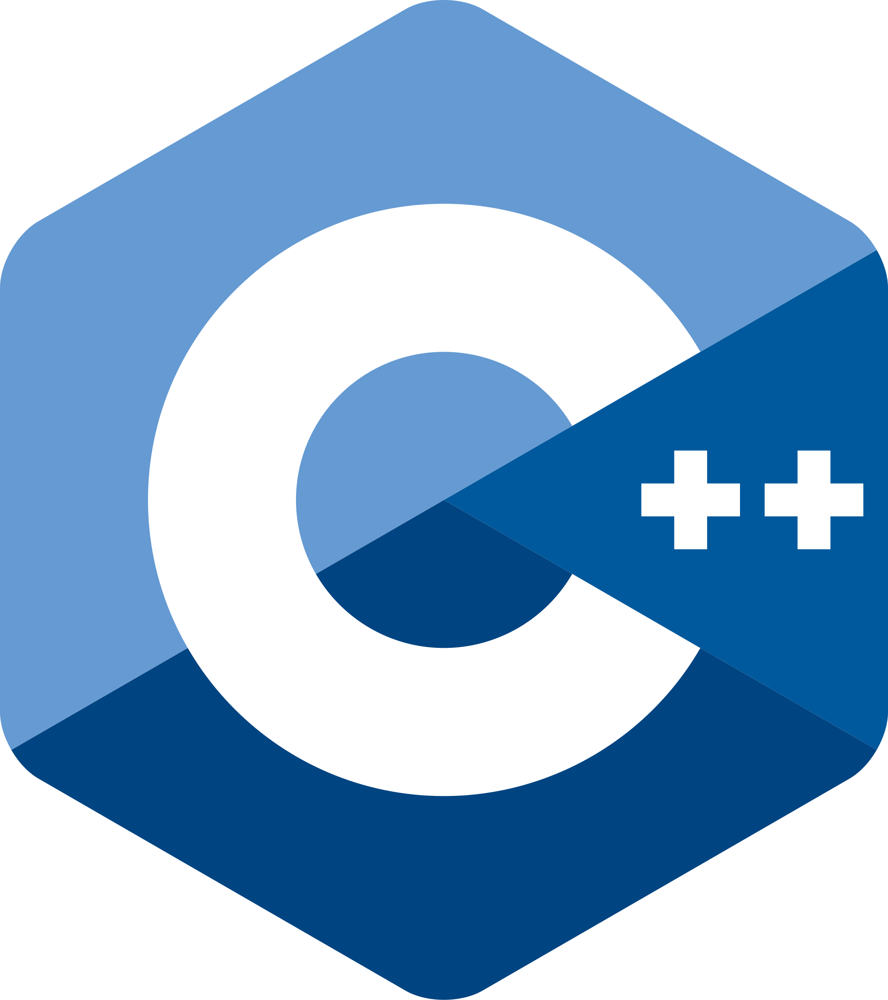

<!-- ====== HERO / BANNER ====== -->
<div align="center">


<a href="https://git.io/typing-svg">
  
</a>

<br/>


</div>

<br/>

<!-- ====== SOBRE MÍ ====== -->
##  Sobre mí

```yaml
nombre:      Edson J. Avila
alias:       PatitaDeZorro
universidad: UACM — Ingeniería de Software
enfoque:     Fullstack Development
filosofía:   "El código más limpio es el que aún no escribiste"
aprendiendo_siempre: true
```

- 🎓 Estudiante de **Ingeniería de Software** en la UACM
- 🔭 Explorando el mundo **Fullstack**: del backend al frontend y viceversa
- 🌱 Me apasiona aprender y fluir con la corriente ante los cambios de la tech
- 💡 Creyente de que el código más limpio es el que aún no escribiste
- 📸 También me encuentras en [@PatitaDeZorroDev](https://instagram.com/PatitaDeZorroDev)

<br/>

<!-- ====== SKILLS ====== -->
## 🛠️ Skills y tecnologías

> **Lenguajes de programación**

<table>
  <tr align="center">
    <td><a href="https://www.java.com"><br/><sub>Java</sub></a></td>
    <td><a href="https://www.python.org"><br/><sub>Python</sub></a></td>
    <td><a href="https://www.iso.org/standard/74528.html"><br/><sub>C</sub></a></td>
    <td><a href="https://isocpp.org"><br/><sub>C++</sub></a></td>
    <td><a href="https://developer.mozilla.org/docs/Web/JavaScript"><br/><sub>JavaScript</sub></a></td>
    <td><a href="https://www.typescriptlang.org"><br/><sub>TypeScript</sub></a></td>
    <td><a href="https://www.mysql.com"><br/><sub>SQL</sub></a></td>
    <td><a href="https://developer.mozilla.org/docs/Web/HTML"><br/><sub>HTML</sub></a></td>
    <td><a href="https://developer.mozilla.org/docs/Web/CSS"><br/><sub>CSS</sub></a></td>
  </tr>
</table>

> **Frameworks y librerías**

<table>
  <tr align="center">
    <td><a href="https://react.dev"><br/><sub>React</sub></a></td>
    <td><a href="https://nodejs.org"><br/><sub>Node.js</sub></a></td>
    <td><a href="https://flask.palletsprojects.com"><br/><sub>Flask</sub></a></td>
    <td><a href="https://restfulapi.net"><br/><sub>REST APIs</sub></a></td>
  </tr>
</table>

> **Testing y QA**

<table>
  <tr align="center">
    <td><a href="https://pytest.org"><br/><sub>pytest</sub></a></td>
    <td><a href="https://coverage.readthedocs.io"><br/><sub>coverage.py</sub></a></td>
    <td><a href="https://junit.org"><br/><sub>JUnit</sub></a></td>
    <td><a href="https://jestjs.io"><br/><sub>Jest</sub></a></td>
    <td><a href="https://www.postman.com"><br/><sub>Postman</sub></a></td>
    <td><a href="https://www.selenium.dev"><br/><sub>Selenium</sub></a></td>
  </tr>
</table>

> **Herramientas y entornos**

<table>
  <tr align="center">
    <td><a href="https://git-scm.com"><br/><sub>Git</sub></a></td>
    <td><a href="https://www.docker.com"><br/><sub>Docker</sub></a></td>
    <td><a href="https://ubuntu.com"><br/><sub>Ubuntu</sub></a></td>
    <td><a href="https://www.microsoft.com/windows"><br/><sub>Windows</sub></a></td>
  </tr>
</table>

<br/>

<!-- ====== DOMINIOS ====== -->
## 🌐 Dominios de tecnología

<table>
  <tr>
    <td width="50%">
      🖥️ <b>Frontend development</b><br/>
      <sub>Interfaces con React, estado y consumo de APIs</sub><br/>
      
    </td>
    <td width="50%">
      ⚙️ <b>Backend development</b><br/>
      <sub>APIs con Node.js, Flask y cliente-servidor</sub><br/>
      
    </td>
  </tr>
  <tr>
    <td width="50%">
      🗄️ <b>Bases de datos</b><br/>
      <sub>Modelado relacional, SQL y esquemas</sub><br/>
      
    </td>
    <td width="50%">
      🧪 <b>Testing &amp; QA</b><br/>
      <sub>Pruebas unitarias, integración y E2E</sub><br/>
      
    </td>
  </tr>
  <tr>
    <td width="50%">
      🐧 <b>Sistemas y SO</b><br/>
      <sub>Linux Ubuntu, bash y entornos de dev</sub><br/>
      
    </td>
    <td width="50%">
      🐳 <b>DevOps básico</b><br/>
      <sub>Git, Docker e integración continua</sub><br/>
      
    </td>
  </tr>
</table>

<br/>

<!-- ====== TROFEOS ====== -->
## 🏆 Trofeos de GitHub

<div align="center">
  
</div>

<br/>

<!-- ====== CERTIFICACIONES ====== -->
## 🏅 Certificaciones

<div align="center">

<!--START_SECTION:badges-->
<!--END_SECTION:badges-->

<a href="https://www.credly.com/users/patitadezorro">
  
</a>

</div>

<br/>

<!-- ====== PROYECTOS ====== -->
## 📌 Proyectos destacados

<div align="center">

<!-- ⚠️ Reemplaza NOMBRE_REPO_1 y NOMBRE_REPO_2 con los nombres reales de tus repos -->
<a href="https://github.com/PatitaDeZorro/NOMBRE_REPO_1">
  
</a>
<a href="https://github.com/PatitaDeZorro/NOMBRE_REPO_2">
  
</a>

</div>

<br/>

<!-- ====== STATS ====== -->
## 📊 Estadísticas de GitHub

<div align="center">

  
  

  <br/>

  

</div>

<br/>

<!-- ====== NOW PLAYING ====== -->
## 🎵 Now Playing

<div align="center">
  <!-- ⚠️ Reemplaza TU_SPOTIFY_UID con tu UID de Spotify -->
  <a href="https://spotify-github-profile.kittinanx.com/api/view?uid=TU_SPOTIFY_UID&redirect=true">
    
  </a>
</div>

<br/>

<!-- ====== CONTACTO ====== -->
## 🌐 Encuéntrame

<div align="center">

  <a href="https://github.com/PatitaDeZorro"></a>
  <a href="https://instagram.com/PatitaDeZorroDev"></a>
  <a href="https://www.credly.com/users/patitadezorro"></a>
  <a href="https://open.spotify.com/user/TU_SPOTIFY_UID"></a>

</div>

<br/>

<!-- ====== FOOTER ====== -->
<div align="center">
  
</div>


