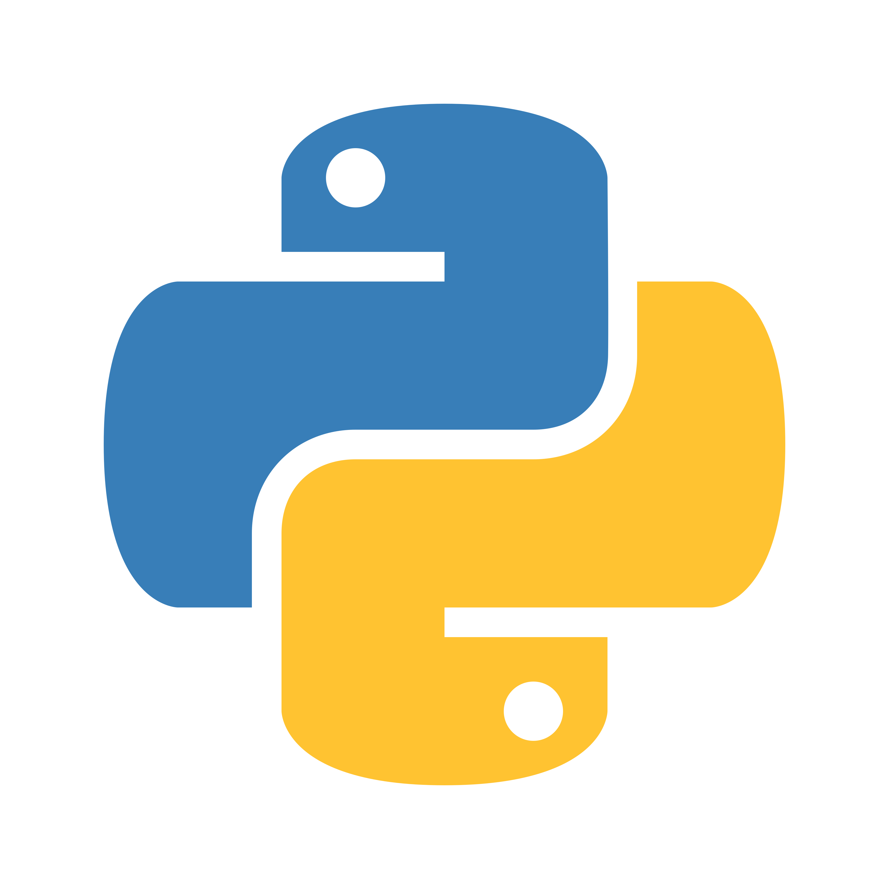
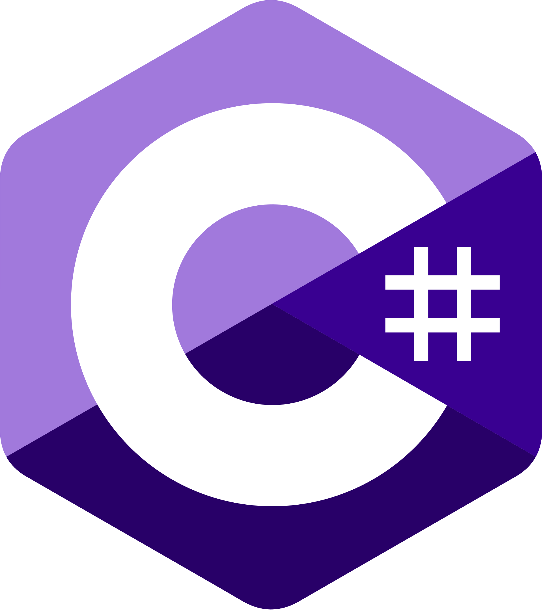
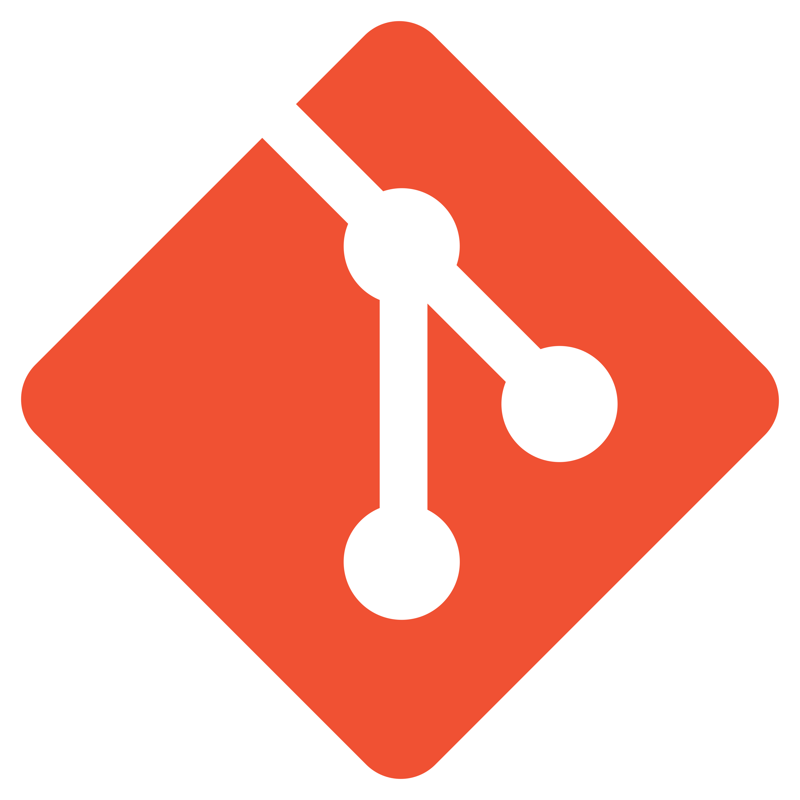
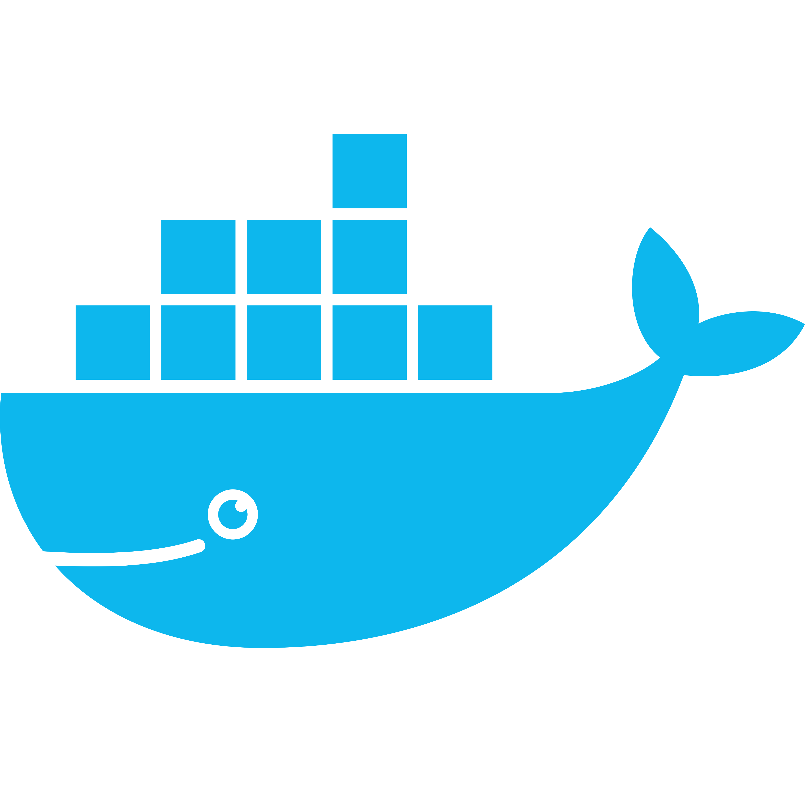

<!-- ============================================================= -->
<!--                        HERO / BANNER                          -->
<!-- ============================================================= -->

  

  <!-- Texto animado -->
  

<!-- ============================================================= -->
<!--                          SOBRE MÍ                             -->
<!-- ============================================================= -->

  

  <table border="0">
    <tr>

Soy un desarrollador en formación con bases sólidas en programación y una fuerte motivación por aprender. Manejo los fundamentos de la lógica de programación, estructuras de datos y algoritmos, y los aplico en proyectos prácticos con los que sigo creciendo. Me siento cómodo trabajando tanto en frontend como en backend, y disfruto el proceso de entender cómo funcionan las cosas a fondo antes de construirlas.

- 🎓 Estudiante de **Ingeniería de Software** en la UACM
- 🎓 Graduado como **Técnico en Telecomunicaciones** por el IPN

    </tr>
  </table>

 

<!-- ============================================================= -->
<!--                     SKILLS Y TECNOLOGÍAS                      -->
<!-- ============================================================= -->

  

<!-- ---------- Lenguajes de programación ---------- -->

  

  <table border="0">
    <tr align="center">
      <td><a href="https://en.wikipedia.org/wiki/SQL"> SQL</a></td>
      <td><a href="https://en.wikipedia.org/wiki/TypeScript"> TypeScript</a></td>
      <td><a href="https://en.wikipedia.org/wiki/JavaScript"> JavaScript</a></td>
      <td><a href="https://en.wikipedia.org/wiki/HTML"> HTML</a></td>
      <td><a href="https://en.wikipedia.org/wiki/CSS"> CSS</a></td>
    </tr>
  </table>

  <table border="0">
    <tr align="center">
      <td><a href="https://en.wikipedia.org/wiki/Java_(programming_language)"> Java</a></td>
      <td><a href="https://en.wikipedia.org/wiki/Python_(programming_language)"> Python</a></td>
      <td><a href="https://en.wikipedia.org/wiki/C_(programming_language)"> C</a></td>
      <td><a href="https://en.wikipedia.org/wiki/C%2B%2B"> C++</a></td>
      <td><a href="https://en.wikipedia.org/wiki/C_Sharp_(programming_language)"> C#</a></td>
    </tr>
  </table>

<!-- ---------- Bases de datos ---------- -->

  

  <table border="0">
    <tr align="center">
      <td><a href="https://en.wikipedia.org/wiki/PostgreSQL"> PostgreSQL</a></td>
      <td><a href="https://en.wikipedia.org/wiki/MySQL"> MySQL</a></td>
      <td><a href="https://en.wikipedia.org/wiki/SQLite"> SQLite</a></td>
      <td><a href="https://en.wikipedia.org/wiki/MongoDB"> MongoDB</a></td>
    </tr>
  </table>

<!-- ---------- Herramientas y Sistemas Operativos ---------- -->

  

  <table border="0">
    <tr align="center">
      <td><a href="https://en.wikipedia.org/wiki/Git"> Git</a></td>
      <td><a href="https://en.wikipedia.org/wiki/GitHub"> GitHub</a></td>
      <td><a href="https://en.wikipedia.org/wiki/Docker_(software)"> Docker</a></td>
      <td><a href="https://en.wikipedia.org/wiki/Ubuntu"> Ubuntu</a></td>
      <td><a href="https://en.wikipedia.org/wiki/Windows"> Windows</a></td>
    </tr>
  </table>

 

<!-- ============================================================= -->
<!--                       CERTIFICACIONES                         -->
<!-- ============================================================= -->

  

  

 

<!-- ============================================================= -->
<!--                     PROYECTOS DESTACADOS                      -->
<!-- ============================================================= -->

  

  <!-- Tarjetas OpenGraph oficiales de GitHub (no dependen de servicios externos) -->
  
  
  
  

 

<!-- ============================================================= -->
<!--                   ESTADÍSTICAS DE GITHUB                      -->
<!-- ============================================================= -->

  

  

 

<!-- ============================================================= -->
<!--                     LINKS DE CONTACTO                         -->
<!-- ============================================================= -->

  

  

 

<!-- ============================================================= -->
<!--                           FOOTER                              -->
<!-- ============================================================= -->

  

